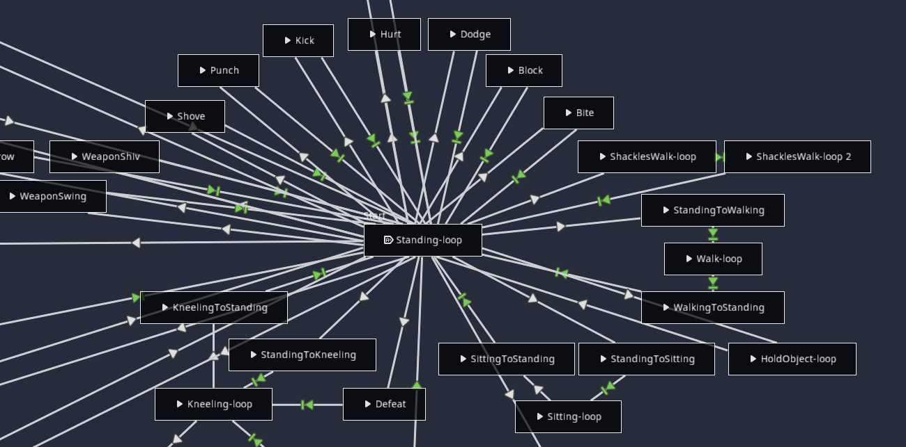
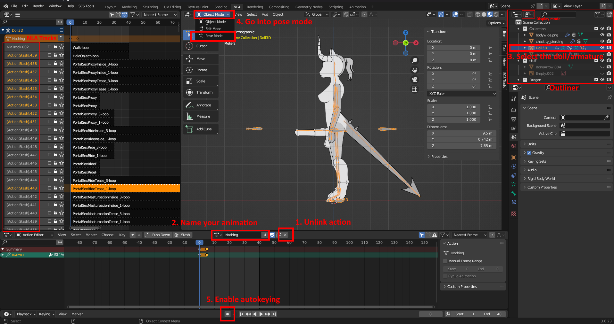
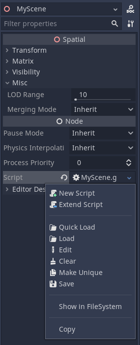
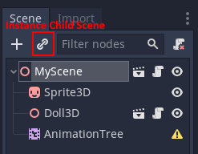
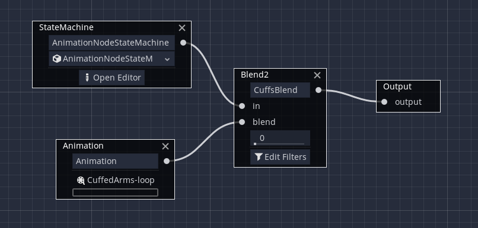
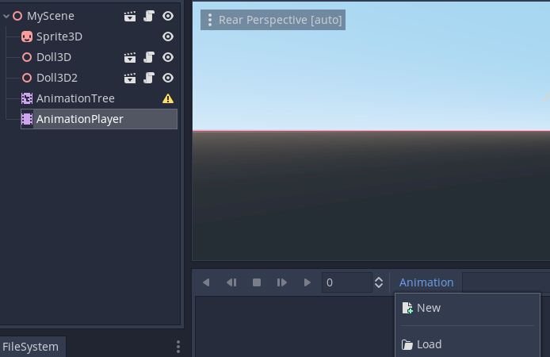
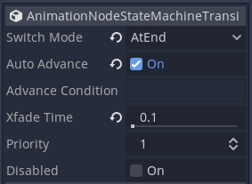
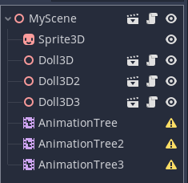

Made as of Game Version `0.2.5`

There are 2 sections to this tutorial, **Learning** and **In Practice**. If you wish to go straight to making animations, skip to **In Practice**.

It's recommend to gain a bit of knowledge on the topic first so you can grasp how the game functions. Without doing so it may be difficult to expand or incorporate more advanced methods not specifically covered in the steps.

Be aware, this tutorial is not for developing beginners and can be difficult to follow if you don't understand a few GODOT and Blender terms or interface locations.

# Learning

**File Names/Usage**
- Dolls and Animations are saved as .glb files. -3D Model File
- Animation resources are referenced to GODOT as .tres files. -Text File
- Stage scripts are read as .gd files. -Text File
- GODOT scenes/nodes are read as .tscn files. -Text File

## **Understanding StageScene & Dolls**

**Doll is just the name Rahi gave to the actual armature file and what is used to reference it in files, so that's what will be used.
Stages are stored in `res://Player/StageScene3D/Scenes(1-3)`

Stages are the 2D (It's actually 3D) render of your doll/character while ingame. Stages define the properties of the 3D scene in the render and are typically named after the subject of the animations (i.e. `Stage.Grope`, `Stage.PuppySexStart`, `Stage.Birth`). 

***Examples of Stage usage***

**Stage.Solo**
- Used for when the game renders only 1 character (Hinted by the name Solo) for general animations. Your character playing the walking animation when you roam around the map is `Stage.Solo`

**Stage.Duo**
- Used for when the game renders 2 characters for non-sex-animations (Also hinted by the name). Your character talking to another in a cutscene is `Stage.Duo`
```gdscript
playAnimation(StageScene.Duo, "stand", {npc="eliza"})
```

**Stage.SexCowgirlAlt**
- Used for when the game renders 2 characters for animations in the "Sex Cowgirl Alt" position during sex.

**Stage.TFLook**
- Used for when the game renders your character for animations to look at their own body during transformation pill cutscenes.
```gdscript
playAnimation(StageScene.TFLook, "crotch", {pc="eliza", bodyState={exposedCrotch=true, hard=true}})
```
This will tell the game to set Eliza as the main focus character, to look at her crotch, expose it, and make her penis erect.

*Most file names are self explanatory.*

#### *Doll.glb*

Dolls are 3D models stored as .glb files. If you have experience with 3D software you'll easily understand armature. Animations (or actions) are stored/"stashed" as NLA (Non-linear Animation) tracks. Little to no animation knowledge is required to use keyframes in the action editor.

## **Outside of a stage.gd file**

Calling to play an animation in a scene is playAnimation() and uses the following parameters:
```gdscript
playAnimation(The StageID[1], The AnimationID[2], Any Arguments[3])
```

[1] The stage will be set by the game with this parameter. It will look for the StageScene with that ID.
- Example: `StageScene.Solo`, `StageScene.BDSMMachineAltFuck`, `"GivingBirth"`, `"YourStage"`

[2] The Animation ID tells the dolls what animation to play.
- Example: `"jog"`, `grope"`, `"firepistol"`

[3] The arguments to support the Animation ID.
- Example: `{pc="artica"}`, `{pc="jacki", bodyState={underwear=hasUnderwear}}`, `{npc="socket", further=true, npcAction=["stand", "res://Inventory/UnriggedModels/BigWrench/BigWrench.tscn"]}`

In Stages, `playAnimation()` will be recieved as:
```gdscript
func playAnimation(animID, _args = {}):
```

_args{} Is a dictionary. If you don't know what that is, refer to [GODOT documentation](https://docs.godotengine.org/en/stable/classes/class_dictionary.html#dictionary).
	
The _args{} Stages tell the game:
- What character to make the focus -> `pc="artica"` Will make Artica the main focus/dominant character
- What to show on the character/scene (i.e. Make a chair appear or a character have no clothes)
- What specific animation to play -> `npcAction="sit"` Will make the NPC character do a sitting animation

## **Inside of a stage.gd file**

All non-solo Stages have a "pc" and "npc". 
PC will be the dominant in a sex scene or the main focus in a non sex scene. That makes NPC the submissive in a sex scene or the secondary focus. PC is often the player's character but can also be used to make a different character the main one, depending on the scene or even the animation.

Most of Rahi's StageScene have 2-3 dolls: 
```gdscript
onready var animationTree = $AnimationTree
onready var animationTree2 = $AnimationTree2
onready var animationTree3 = $AnimationTree3
onready var doll = $Doll3D
onready var doll2 = $Doll3D2
onready var doll3 = $Doll3D3
```

If you wish to add more dolls, you'll have to add more Doll3D and AnimationTree nodes in your stage's .tscn file.

There are a few important functions for Rahi's stages:

#### `func getSupportedStates():`
- getSupportedStates() is an array and will dictate what animationIDs the Stage can recieve. For [Duo.gd](https://github.com/Alexofp/BDCC/blob/main/Player/StageScene3D/Scenes/Duo.gd#L117), it will return `getSupportedStatesSolo()` which is an array of standard base animationIDs like `"stand"`, `"walk"`, `"jog"`, etc.*
- If you called `playAnimation(StageScene.CheckPaw, {npc="nova"})`, the stage will error as "sit" will not be apart of [getSupportedStates()](https://github.com/Alexofp/BDCC/blob/main/Player/StageScene3D/Scenes2/CheckPaw.gd#L95).

#### `func playAnimation(animID, _args = {}):`
- Somewhat explained *[earlier](https://github.com/iiHartMemphisii/BDCC-Lotterus-WIKI/wiki/Animations-Page-Wiki-Test#outside-of-a-stagegd-file)*.
- All self explanatory when looking at the function yourself. Sets what is shown in the stage and passes the AnimID to either `state_machine.travel()` or `stateMachineTravel()`

#### `func stateMachineTravel(thedoll, state_machine, animID):`
- Not in all stage.gd files (Inside BaseStageScene3D.gd).
- More parameters and arguments for settings.

#### `state_machine.travel()`
- The actual function that calls the animation to the doll. Takes the actual name of an animation stored in a Doll.glb file.
- Corresponds to the animation tree for each doll you have in the stage. If you have 3 dolls in a stage ([ButtStackSex.gd](https://github.com/Alexofp/BDCC/blob/main/Player/StageScene3D/Scenes/ButtStackSex.gd#L80-L82)), you'd have:
```gdscript
var state_machine = animationTree["parameters/StateMachine/playback"]
var state_machine2 = animationTree2["parameters/StateMachine/playback"]
var state_machine3 = animationTree3["parameters/StateMachine/playback"]

if(animID == "tease"):
		state_machine.travel("ButtStackSexTease_1-loop")
		state_machine2.travel("ButtStackSexTease_2-loop")
		state_machine3.travel("ButtStackSexTease_3-loop")
```
<div align="center">
   <sup>Each doll has their own animation to do in a stage</sup>
</div>
- Animation Trees and Animation Player nodes are explained below

The avaliable arguments in an existing stage are obviously limited to what the .gd file calls for. You can quite obviously add your own arguments and functions. Self problem-solving and improvision is key, this is just the run-down on Rahi's stages.

## **Inside of a stage.tscn file**

.TSCN files hold the node structure for a scene, however there are only 3 node types you need to worry about:

#### [AnimationPlayer](https://docs.godotengine.org/en/stable/classes/class_animationplayer.html)
- Holds the references to .tres files for animations
- Child to DollSkeleton Spatial nodes

*Useful Properties*

***Speed/playback_speed (Value)***

#### [AnimationTree](https://docs.godotengine.org/en/stable/classes/class_animationtree.html#animationtree)
- Creates transitions from animation to animation using animations in the AnimationPlayer
- Stored as a .tres file ([DollSoloAnimationTree.tres](https://github.com/Alexofp/BDCC/blob/main/Player/StageScene3D/Scenes/DollSoloAnimationTree.tres))
- Example: `Standing-loop` -> `Defeat` -> `Kneeling-loop`

#### [Spatial](https://docs.godotengine.org/en/3.6/classes/class_spatial.html)
- The actual 3D instance that renders the doll/character

**Useful Properties**

***Transform (You should know what a X, Y, Z axis is.)***
- *Translation* (X, Y, Z)
- *Rotation Degrees/rotation_degrees* (X, Y, Z)
- *Scale* (X, Y, Z)

****Visible (boolean)***

.TSCN files can be edited in text editors manually but it's recommended to use the GODOT engine for anyone not knowing what they're doing

## **DollSoloAndCuffsTree.tres and DollSoloAnimationTree.tres**

These 2 files are essential to animations:

**DollSoloAndCuffsTree.tres**
- Blends 2 animations together. This specifically is used to overwrite arm/leg animations when a character is cuffed, putting their hands behind their back or feet together.

**DollSoloAnimationTree.tres**
- Essentially a flow chart for animations. Used to advance from 1 animation to another in succession.
- Example: You call `stateMachineTravel(doll, state_machine, Walk-loop)`, the Animation Tree will run `Standing-loop` -> `StandingToWalking` -> `Walk-loop`


<div align="center">
   <sup>Animation Tree editor in GODOT. All animations start with and are connected to Standing-loop. The animations in your stage can be centered around a different animation if you wish.</sup>
</div>

# In Practice

**What tools you'll need** (You'll most likely have all of this already if you're attempting an animation mod)
- GODOT Engine 3
- BDCC Project File
- Blender (v3.6 recommended)
- Text File Editor

## **Setup**

**File Structure**

It's recommended to keep folder structure similar to how the base game does. Only rename/reorder if you know what you're doing.

**Folders to create:**
- `res://Modules/YourModule/Player`
- `res://Modules/YourModule/Player/Player3D`
- `res://Modules/YourModule/Player/StageScene3D`

*All the needed files will reside in `res://Modules/YourModule/Player`*
- `res://Modules/YourModule/Player/Player3D` Stores the Doll.glb related files.
- `res://Modules/YourModule/Player/StageScene3D` Stores the Stage related files.

## **Blender**

*Keep in mind, this is NOT a Blender tutorial. If you need assistance on Blender's complete interface, look up documentation.*

- Launch Blender and open `DollSkeleton.blender` in your BDCC project files. (`res://AssetsSource/character`)
- **(Heavily recommended but not required)** Change the Display Mode of the Outliner to Blender File and delete NLA actions (`Current File` -> `Actions`) you won't use in-game or as references (This drastically cuts down the file size and much easier to export), followed by deleting unused NLA tracks. Change the Display Mode of the Outliner back to View Layer.
- Unlink the current action and create a new Action OR make a Single User Copy of an existing track to use as a reference.
- Select the Doll3D armature in the outliner and change Object Interaction mode to "Pose"
- Enable Auto-Keying
- Animate!



### Animation Tips

The Doll armature uses [Inverse Kinematics](https://docs.blender.org/manual/en/latest/animation/armatures/posing/bone_constraints/inverse_kinematics/introduction.html), meaning not all bones need to be individually animated. Moving the armature's feet will have the upper and lower leg follow accordingly, same with hands and arms.

There are only 9 main bones you need to keyframe:
- Hands Left and Right
- Feet Left and Right
- Hips
- Chest
- Neck
- Head
- Tail (1-5)
- Penis (1-3)
- Balls

Try moving bones around and see how the joints follow for yourself!

**Major Note:** If you want your action/animation to be a loop, be sure to add "-loop" to the end of the name. 
- Example: `DoggyStyle3SexFast` -> `DoggyStyle3SexFast-loop`

Once you've finished animating your action, stash the action to the NLA stack. Export the Doll as a .glb file and you're ready for GODOT. You can name the file anything for ease of memory. Place your exported Doll.glb file in `res://Modules/YourModule/Player/Player3D`

## **GODOT**

*Keep in mind, this is NOT a GODOT tutorial. If you need assistance on GODOT's complete interface, look up documentation.*

Duplicating examples of .tscn files and changing  will be done for ease of creation

Launch GODOT engine and open the BDCC project file

**Re-Importing Doll.glb/Obtaining animation.tres files**
- Set the Animation FPS property to 24. The default is 15.
- Leave all other settings as default (unless you know what you're doing) and then re-import.

*Now you need to obtain your animation.tres files for future use*
- Make a copy of your Doll.glb and put it in temporary folder you can easily delete (Example: `res://Modules/YourModule/Player/Player3D/TresDump`)
- Set the Animation Storage property to Files (.tres). The default is "Built-In".
- Re-import

Depending on how many animations your Doll has, it may take a second. They will be used to create your Animation Tree.

### DollSkeleton.tscn and Doll3D.tscn

*Keep in mind this isn't the usual way to make .tcsn files, but this method is much easier than recreating Doll3D.tscn in the GODOT engine for the same effect. This is outside of GODOT.

#### DollSkeleton.tscn
- Duplicate DollSkeleton.tcsn `res://Player/Player3D` and move it to your own Player3D folder (`res://Modules/YourModule/Player/Player3D`). Rename it (YourName)DollSkeleton.tscn
- Open (YourName)DollSkeleton.tcsn in a text file editor and edit the 1st resource line, replacing Rahi's DollSkeleton.glb with your own.

`[ext_resource path="res://Player/Player3D/DollSkeleton.glb" type="PackedScene" id=1]` -> `[ext_resource path="res://Modules/YourModule/Player/Player3D/(YourName)Doll.glb" type="PackedScene" id=1]`

#### Doll3D.tscn
- Duplicate Doll3D.tcsn `res://Player/Player3D` and move it to your own Player3D folder (`res://Modules/YourModule/Player/Player3D`). Rename it (YourName)Doll3D.tscn
- Open (YourName)Doll3D.tcsn in a text file editor and edit the 1st resource line, replacing Rahi's DollSkeleton.tscn with your own.

`[ext_resource path="res://Player/Player3D/DollSkeleton.tscn" type="PackedScene" id=1]` -> `[ext_resource path="res://Modules/YourModule/Player/Player3D/(YourName)Skeleton.tscn" type="PackedScene" id=1]`

### Stage.gd creation

It's recommended to clone an existing Stage.gd file base as to not have to completely create a script file from scratch.

- Copy [Duo.gd](https://github.com/Alexofp/BDCC/blob/main/Player/StageScene3D/Scenes/Duo.gd) (`res://Player/StageScene3D/Scenes`) and move it to your own StageScene3D folder (`res://Modules/YourModule/Player/StageScene3D`)
- Change functions (Stage's ID, Supported States, etc)

```gdscript
func _init():
	id = "YourStage"

func getSupportedStates():
	return ["MyAction1", "MyAction2", "MyAction3", "MyAction4"]

func playAnimation(animID, _args = {}):
	var fullAnimID = animID
	if(animID is Array):
		animID = animID[0]
	
	print("Playing MyStage animations: "+str(animID))

(. . .)
	
	if(animID in ["MyAction2", "MyAction4"] || (_args.has("further") && _args["further"])):
		doll.transform.origin.x = 2.5
	else:
		doll.transform.origin.x = 1.5

	var state_machine = animationTree["parameters/AnimationNodeStateMachine/playback"]
	if(!stateMachineTravel(doll, state_machine, fullAnimID)):
		Log.printerr("Action "+str(animID)+" is not found for stage "+str(id))
```
<div align="center">
   <sup>playAnimation("YourStage", "MyAction3", {npc="nova"})</sup>
</div>

*You can rewrite your Stage.gd file from there. Just keep in mind Duo.gd will point to nodes that your stage may not use (Like $Chair or $KidlatBox)*

### Stage.tcsn creation

*Back into the GODOT Project Engine

- Create a new Inherited Scene of BaseStageScene3D.tscn (`res://Player/StageScene3D`) OR your own modified BaseStageScene3D.tscn if you have one
- *(Optional)* Rename the BaseStageScene3D node to the name of your scene
- Load (YourStage).gd as the script property for the base node



#### Creating the platform

- Create a Sprite3D child node
- Load platform.png from `res://Player/Props`
- Enable Region
- Set property Region Rect (X, Y, W, H) -> `X = 1`, `Y = 1`, `W = 1022`, `H = 62`
- Set property Transform Translation (X, Y, Z) -> `X = 0`, `Y = -0.197`, `Z = -1.775`

(These property values are for if you don't know what you're doing)

#### Adding Character Dolls

- Create an Instance Child Scene node using (YourName)Doll3D.tscn (`res://Modules/YourModule/Player/Player3D`)
- Create an AnimationTree node under the base node



#### Creating an [AnimationTree](https://docs.godotengine.org/en/stable/classes/class_animationtree.html#class-animationtree)

- Load DollSoloAndCuffsTree.tres (`res://Player/StageScene3D/Scenes`) as the Tree Root property in the Inspector
- Make the Tree Root unique
- (Only if you wish to completely make your own node and know how) Delete the StateMachine node
- Save it as (YourName)Tree.tres with your stage files (`res://Modules/YourModule/Player/Player3D`)

<div align="center">
   <sup>Animation Nodes</sup>
</div>



If you deleted the StateMachine node:
- Create a new StateMachine node

For all:
- Open the StateMachine (AnimationNodeStateMachine) editor
- Create your [StateMachine Animation Tree](https://docs.godotengine.org/en/stable/tutorials/animation/animation_tree.html#statemachine)

#### StateMachine Animation Tree Tips

*All animations will start from your center animation.

To add animation nodes to the tree:
- Create an AnimationPlayer Child Node
- Assign the AnimationTree node's Anim Player property to the new AnimationPlayer
- Load all your created animation.tres files into the AnimationPlayer (Created when you imported Doll.glb into a temporary folder)



If starting from scratch:
- Create a start animation
- Branch off/continue from there

If adding onto the existing tree:
- Add your animation node connections starting from Standing-loop
- Use existing nodes as examples for properties for your new animation nodes (`Switch Mode`, `Auto Advance`, `Xfade Time`, `Priority`)



Once you have created your StateMachine, save your Tree Root. You can now load it if you wish to add more animations, nodes, properties, etc.
- Up to you to delete the AnimationPlayer child node to clean up

**If you wish to add more than 1 character to your stage, duplicate your Doll3D and AnimationTree nodes for however many characters you wish. Keep in mind to edit (YourStage).gd accordingly.**



## **Adding your stage to the game**

Now that you've created the stage files:
- Open your Module.gd (`res://Modules/YourModule`)
- Add the `stageScenes = []` array along with `(YourStage).tcsn` to `_init()`
```gdscript
func _init():
	id = "YourModule"
	author = "You"

	scenes = [ . . . ]
	characters = [ . . . ]
(. . .)
	stageScenes = [
		"res://Modules/YourModule/Player/StageScene3D/YourStage.tscn",
	]
```

## **Call your stage while in a scene**

```gdscript
extends SceneBase

func _init():
	sceneID = "YourScene"

func _run():
	if(state == ""):
		addCharacter("tavi")
		playAnimation("YourStage", "MyAction1", {npc="tavi", npcAction="MyAction4"})

		saynn("You scream out in joy as you watch Tavi and your character do an odd dance together.")

		saynn("[say=pc]Victory at last![/say]")
```